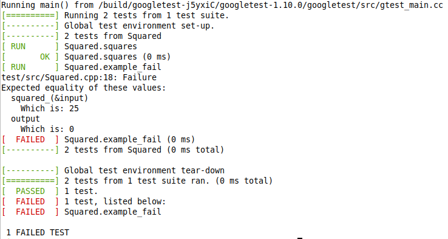

# Fortran Testing

I've always avoided Fortran when developing software. I've never completely trusted that any testing tools available we continue to be available and/or supported. This repo gives an example of how to link Fortran code with C/C++ and a testing framework, to allow testing with whatever preferred framework.

## Preliminaries

### The Makefile

I've made a deliberate choice to keep the Makefile included here as explicit and self-explanatory as possible. I don't want the Makefile to represent a layer of complication for the reader. Therefore, there are no macros, and a lot of logic and repeated variables are 'baked in'.

Hence, the example Makefile is neither pretty nor succinct.

## Choice of testing framework

I've picked [Google Test/gtest](https://github.com/google/googletest/) because I'm familiar with it. This should work with any preferred test framework.

## Language and Linking Technicalities

Fortran and C/C++ make differing assumptions about data sizes, and passing by value or reference (more specifically, pointer). There are a few other important points that I don't cover as we work through this code linking. I've found the [Oracle Documentation](https://docs.oracle.com/cd/E19422-01/819-3685/11_cfort.html) to be an excellent resource, and I strongly recommend reading through this before attempting to replicate this method in a project.

Some Fortran coders like to keep things in capital letters. I find it more readable not to.

## Platform

This example was developed and tested in a Linux (Debian) environment, since this is common with Fortran developers who typically require a technical/scientific environment. I've selected gfortran/gcc/g++ because it is widely available. Version 9.4.0 of gfortran/gcc/g++ was used.

## Implementation

### The Fortran Test Target

The test target (a function, but this should work equally with a subroutine) exists in the dedicated source file `fortran_app/src/lib/Squared.f90`. This permits both the intended client Fortran application and the test harness to link to the function. The function is compiled as a shared object file. The function is defined as follows:

```
function Squared(i) bind(C, name="squared_")
  implicit none
  real(kind=8) :: Squared
  real(kind=8), intent( IN ) :: i
  Squared = i*i
end function Squared
```

The important points to note here are:

1. **`bind(C, name="squared_")`** has been added to the function definition. This directive declares that a `C` compatible calling convention is to be used. Amongst other things, this overrides the Fortran name mangling rules to match the expectation of the C linker, which prevents the main Fortran program from calling the function using the default source name. Since we are trying to test a Fortran code, and we are not building a library primarily for consumption by a C/C++ code, the `name="squared_"` statement has been added to rename the function symbol to match the expectation of the default Fortran naming convention, so the `bind` directive is effectively transparent to the rest of the Fortran code. We must therefore call function from our C/C++ with the name "squared_", whilst the rest of our Fortran source can continue to use the name "Squared".
2. **`(kind=8)`** has been added to the `real` types. This must match the type in the C/C++ code. On x86, this corresponds to a `double`. See [Oracle Documentation](https://docs.oracle.com/cd/E19422-01/819-3685/11_cfort.html).

The main Fortran program is found at `fortran_app/src/fortran_app.f90`. This is defined as follows:

```
program Square
  implicit none
  real(kind=8):: i, Squared
  print *, 'Enter number: '
  read *, i
  print *, 'Squared: ', Squared(i)
end program Square
```

The only point to note is that the name of the fucntion being called is as expected.

The code is compiled by creating the *shared object* file which contains the target function. We are creating a shared object (`-shared`), and we need position independent code (`-fPIC`).

`gfortran -std=f2018 -shared -fPIC -o fortran_app/bin/lib/libSquared.so fortran_app/src/lib/Squared.f90`

The main program must link to the new shared object ('-lSquared'), and we must specify the path of the shared object (`-L*path`).

`gfortran -std=f2018 -Lfortran_app/bin/lib fortran_app/src/fortran_app.f90 -lSquared -o fortran_app/bin/fortran_app`

This is dynamic linkage (we might prefer static for the Fortran applicaton). We must specify the search path of any required shared objects. The Bash shell allows us to do this on execution with the LD_LIBRARY_PATH variable. This is not needed if the shared object is in the standard search path, if we edit the search path in the shell environment, or if we statically link:

`LD_LIBRARY_PATH=fortran_app/bin/lib fortran_app/bin/fortran_app`

### Linking with a C application

A C program that links to a fortran-coded shared object might look like the example in `c_app/src/c_app.c`:

```
#include <stdio.h>

extern double squared_(double* i);

int main(void)
{
	double i = 5;
	
	printf("%6.2f\t%6.2f\n", i, squared_(&i) );
	
	return 0;
}
```

The important points to note here are:

1. The function we are calling has been *declared* (not *defined*).
2. The function is named `squared_`. This is because we chose to keep the Fortran naming convention. This is the string we defined with `name="squared_"` in the `bind` directive.
3. The function takes a pointer, which is how Fortran functions receive their parameters.
4. When calling the function, we pass the address.

The code is compiled with:

`gcc -Lfortran_app/bin/lib c_app/src/c_app.c -lSquared -o c_app/bin/c_app`

Similar to the compilation of the Fortran code, we specify the location of shared libraries, and link to the sahred library with the same compiler/linker flags.

As with the Fortran code, we specify the shared object search path on execution:

`LD_LIBRARY_PATH=fortran_app/bin/lib c_app/bin/c_app`

### Linking with a test suite

Since I've selected [Google Test/gtest](https://github.com/google/googletest/), we must link to C++ compiled code. The test file is foun at `test/src/Squared.cpp`.

```
#include <gtest/gtest.h>

extern "C" double squared_(double* i);

TEST(Squared, squares)
{
	double input=5;
	double output=25;
	
	EXPECT_EQ(squared_(&input), output);
}

TEST(Squared, example_fail)
{
	double input=5;
	double output=0;
	
	EXPECT_EQ(squared_(&input), output);
}
```

Similar to the C application that linked to the Fortran shared object, the function is declared with the Fortran-mangled name. However, the declaration is flagged as `extern "C"`. This instructs the C++ compiler/linker to apply C-style name mangling to the function during linkage. In effect, C convention has been used to provide a common interface between the Fortran code (using `bind`) and the C++ code (using `extern "C"`). Like the previous C example, paramters are passed by address.

The rest of the C++ source file is simply the syntax of the test suite.

The file is compiled with:

`g++ -fopenmp -Lfortran_app/bin/lib test/src/Squared.cpp -lSquared -lgtest -lgtest_main -o test/bin/test`

As with the previous examples, we will specify the shared library search path in Bash at execution:

`LD_LIBRARY_PATH=fortran_app/bin/lib test/bin/test`

On execution, we are presented with the gtest "red/green" report:

